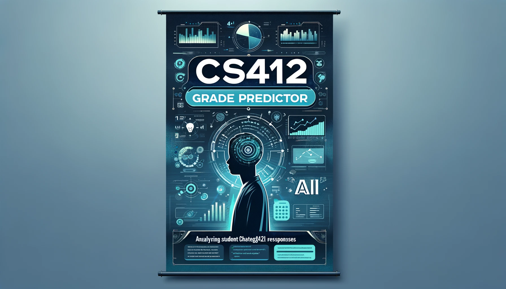

# ChatGPT Grade Predictor
  
### Project Overview
The ChatGPT Grade Predictor is a Machine Learning project for the CS 412: Machine Learning course at Sabanci University. The project is aimed at exploring the correlation between student interactions with ChatGPT and their assignment scores. Leveraging various techniques and numerous machine learning models, this project seeks to predict grades with a focus on creative and innovative approaches.

### Dataset
The dataset includes a collection of ChatGPT interaction logs in HTML format and corresponding assignment scores. Each log file is uniquely identified, enabling a match with the respective scores. These HTML files can be located at the `project-material/dataset` folder.

### Objectives
- To preprocess and analyse ChatGPT interaction data through the HTML files in our dataset.
- To engineer features that effectively capture the essence of the interactions, and understand the patterns to predict the respective score for the homework for each student.
- To develop and evaluate models capable of predicting assignment scores.
- To explore creative and novel approaches in data handling and model creation regarding grade prediction for homework through students' ChatGPT interaction.

## OVERVIEW OF THE REPOSITORY: 

**1. Preprocessing:** During our preprocessing sections in our project we have taken action to clean, transform, and organize raw data into a suitable format, ensuring it is free of inconsistencies and optimized for analysis.   
   
As a part of our preprocessing for the project can be seen above, we have worked on several approaches. These approaches during our preprocessing procedure have been explained in detail in our methodology section below. 

**2. Feature engineering:** For our Feature Engineering section in our project we have aimed to select, manipulate, and transform raw data into meaningful and relevant features that enhance the performance and accuracy of the model. We have decided to display some of the actions that we have taken through images and brief explanations below.
   
   
gives sentimental value of the user prompts by emotion analysis

   
checks for the similarity of the question asked with the actual question

   
checks if the questions were solved one by one or in a disorganized way

                                **There are many more features implemented which can be seen in the ipynb file**

**3. Results:** shows the performance of the model
  
	Average R^2 and MSE values of the model with cross-validation and scalar

## METHODOLOGY: 

### A. Preprocessing:

To explain the actions taken in the preprocessing part of our project we have aimed to work on several approaches: 

1. Removing the HTML tags
2. Converting text to lowercase
3. Removing special characters and punctuation
4. Tokenization
5. Removing stop words
6. Lemmatization

Then we continued on our preprocessing procedure, being more considerate and careful after further examining the dataset. After this examination, we have decided to move on with the added preprocessing actions:

7.  Removing further non-ASCII characters (Irrelevant letters were not preserved)
8.  Removing words that include numbers
9.  Removing words that include less than 3 characters or more than 25 characters
    (Unnecessarily short or long words were not preserved due to their irrelevancy in the analysis)
11. Removing numbers
12. Removing user data with less than 5 prompts

After this procedure of preprocessing, we then have moved on to work on feature engineering.

### B. Feature Engineering:

In the feature engineering part of the project, we have worked on producing creative, and effective features that aimed to better predict the scores for the homework. These features that were developed and use to predict scores can be categorised as below.

1. **Sentiment Analysis:**

- **Emotion Analysis (disgust, fear, joy, sadness, surprise, trust, anticipation, positive, negative):** Utilizing tools for automated sentiment analysis to determine the emotional tone of user messages. Our hypothesis was to find a link between negative emotions such as disgust, sadness and fear and being confused or frustrated, which will affect the grade of the homework.
- - **Polarity and Subjectivity Scores (total\_subjectivity, avg\_subjectivity, total\_polarity, avg\_ polarity):** Quantifying the sentiment of user messages in terms of positivity/negativity (polarity) and objectivity/subjectivity. TextBlob library is used and insights about the overall sentiment and subjectivity of user interactions are provided.
- **Friendliness Level:** Average friendliness of the users was assessed by analyzing greetings and polite expressions. We assumed a friendlier tone could change the effectiveness of ChatGPT's tendency to solve questions. The mean vector of these words is computed using the Word2Vec model, resulting in a vector representation of "friendliness". The friendliness score is calculated by measuring the cosine similarity between the user text vector and the predefined "friendly" vector. We ended up deleting this feature because it did not improve the model and downloaded 1.5 GB every time the cell ran.
  
2. **User Interaction Patterns and Language Use:**

- **Inclusion of Specific Words (user\_clarify\_point, gpt\_clarify\_point):** Identifying the presence of words indicating correctness or errors in user prompts including "no, misunderstood, incorrect, sorry" to identify clarifying done by both the user and ChatGPT.
- **Use of uppercase letters (gpt\_caps\_rate, user\_caps\_rate)**  **:** Counting the number of words in all caps to infer emphasis or strong emotion.

3. **Conversational Dynamics and Responsiveness:**

- **Frequency of Question and Exclamation Marks (question\_marks, exclamation\_marks):** Analyzing punctuation usage to understand query types and emphasis.
- **ChatGPT Response Analysis:** Studying the similarity in ChatGPT's responses and looking for correction indicators (like "apologies ") to gauge the user's understanding and ChatGPT's guidance.
- **Readability Score (flesch\_readibility):** Evaluating the complexity of the text in the conversation.
- **Code and Mathematical Expression Patterns (math\_expressions, math\_expressions\_gpt):** Analyzing the structure and occurrence of code snippets or mathematical expressions in the conversation.

4. **Question-Answering Behavior and Sequence:**

- **Resolution Time for Questions (Q1, Q2…):** Best cosine similarty according to spesific question.
- **Question attempt count (Q1\_count, Q2\_count…):** The primary goal of these features (Q1_count, Q2_count, etc.) is to quantify the number of attempts or prompts made to solve each specific question in a dataset. 
- **Order of Questioning (solve\_one\_by\_one):** Assessing whether the user followed a logical flow or jumped between questions in a disorganized manner.

5. Other Features: All the included features that are not explained in detail above can be seen in the heatmap in the following section (promt\_avg\_char, respone\_avg\_char, smog\_index and the existing features).
   
## RESULTS: 

   

The distribution of homework scores shows how uneven and skewed the data is.

   

Grade distribution after the outliers that have low grades and low prompt numbers are discarded.

   

Boxplot showing the distribution of grades given whether "thanks" was used or not.

   

Heatmap of the existing features and added engineered features and their correlations are shown on a heatmap.

   

Code Patterns in GPT responses and the homework grades.

   

Average R^2 and MSE values of the model with cross-validation and scalar

   

Comparison of R2 scores of different methods.

## TEAM CONTRIBUTIONS: 
1. İsmail Çakmak: Conversational dynamics and responsiveness, cross-validation and normalization.
2. Göktuğ Gökyılmaz: Question-answering behavior and responsiveness, testing the subsets of features.
3. Mustafa Harun Şendur: User interaction patterns and language usage, data visualization.
4. Pınar Şen: Sentiment analysis with subjectivity scores and emotion analysis, preparing the README file.

Brainstorming for new feature ideas, division of work and determining the preprocessing steps were done as a team. 

   
(Image created by DALL-E, 2024)
